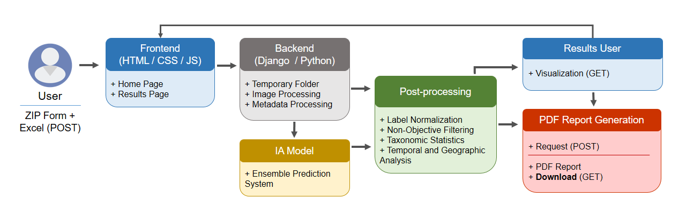
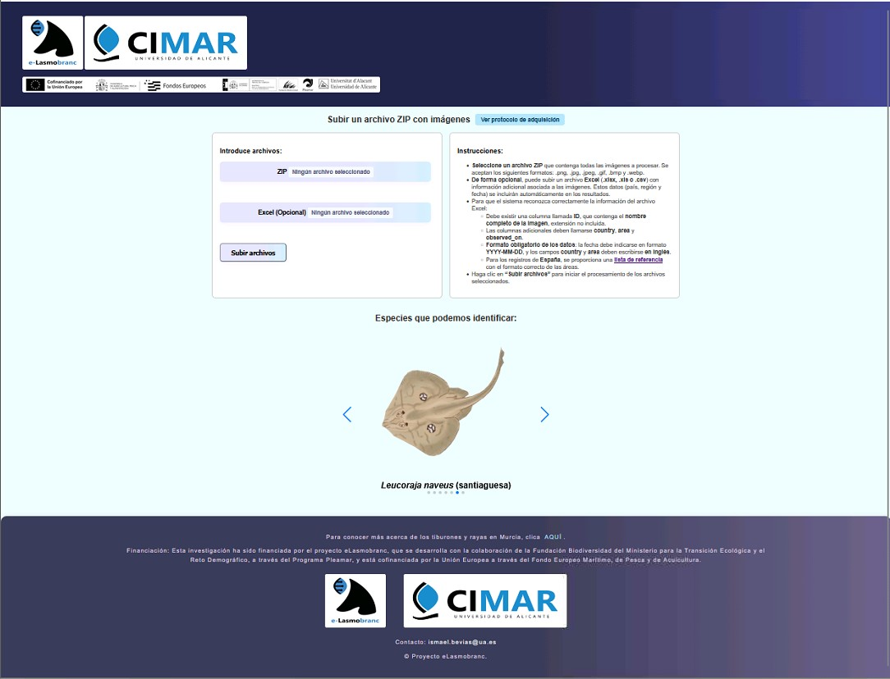
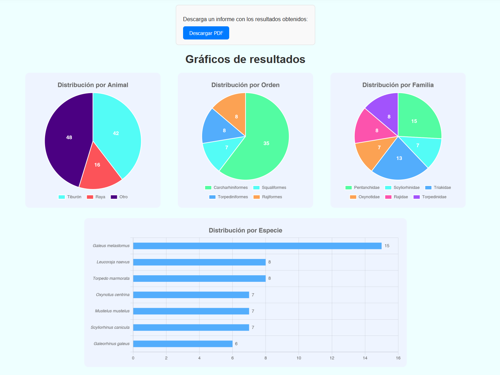
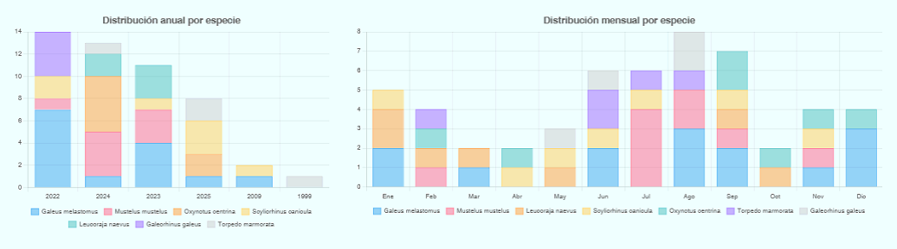
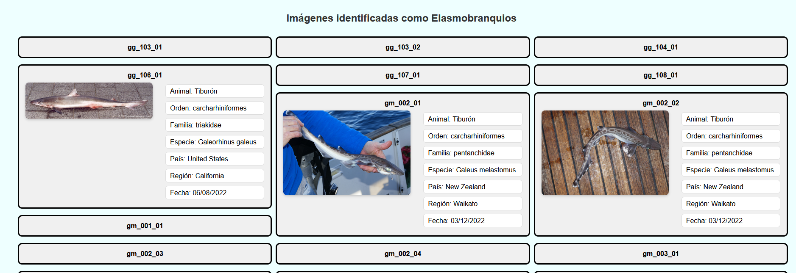
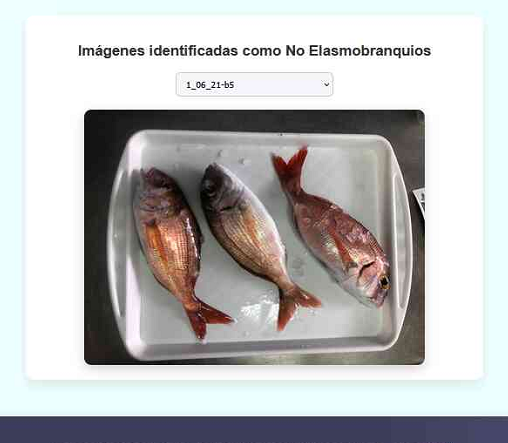

# 🌐 Web Application Overview

This application represents the integration and culmination of multiple prior tasks within the eLasmobranc project, including dataset construction and the development of artificial intelligence models. It provides a functional pipeline for the automatic analysis of large image collections, enabling elasmobranch detection, multi-level taxonomic classification and automated statistical reporting.

# 🏗️ System Architecture

The application follows a client-server architecture. Users interact with a responsive frontend built with **HTML**, **JavaScript** and **CSS**, structured into two main views: a landing page for data upload and a results page for visualization and analysis.

The backend is implemented in Python using the **Django framework**, which centralizes the application logic and handles request routing, view management and basic security mechanisms. Communication between frontend and backend is performed via HTTP requests through a **REST-style API**.

  

# 🏗️ Application Features

The web application capabilities is organized into three main components, corresponding to the system’s functional views: the landing page, the results page, and the PDF report.

## 🏠 Landing Page

The landing page serves as the user’s entry point to the system and is primarily dedicated to data submission for automatic image processing. Its central element is an upload form that allows users to provide a compressed ZIP file containing the images to be analyzed and, optionally, an Excel file with associated metadata.

To support correct usage, the page includes brief instructions guiding users through the data upload process. In addition to its core functionality, the landing page provides educational resources, including access to an image acquisition protocol and a link to an online book with background information on the target species.

  

## 📊 Results Page

The results page is loaded once server-side processing is complete and focuses on interactive visualization of the analysis. A PDF export button is displayed at the top, allowing users to download the full report. First, model outputs are presented as taxonomic distribution charts, enabling comparison across different hierarchical levels.

  

Next, a temporal analysis per species is provided at both yearly and monthly scales, highlighting observation patterns and facilitating comparison between classes. A geographical analysis follows, showing country-level distributions together with a detailed breakdown across Spanish autonomous communities for localized interpretation.

  
  

Finally, a dedicated section displays individual elasmobranch detections along with model predictions and associated metadata. An additional block groups non-elasmobranch images to support manual review.

  
  

